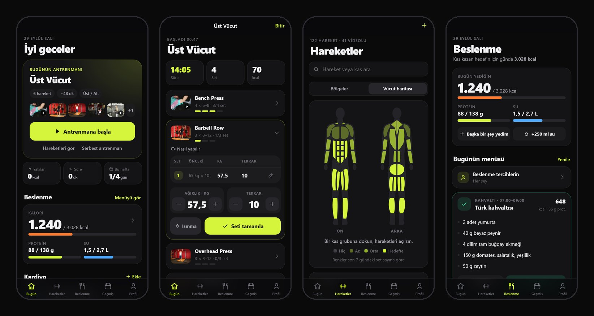
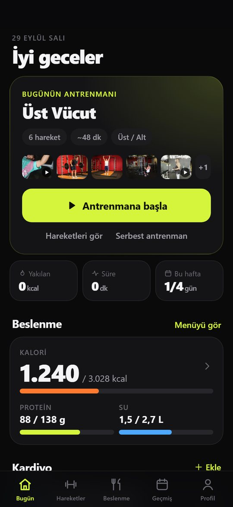
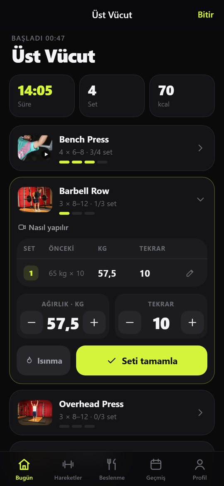
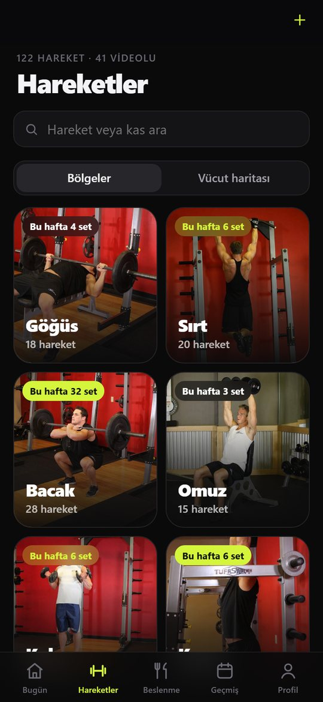
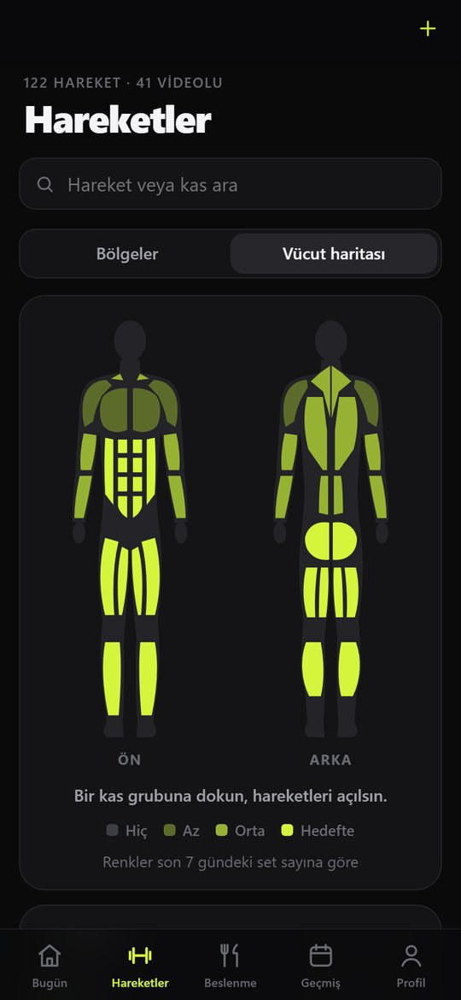
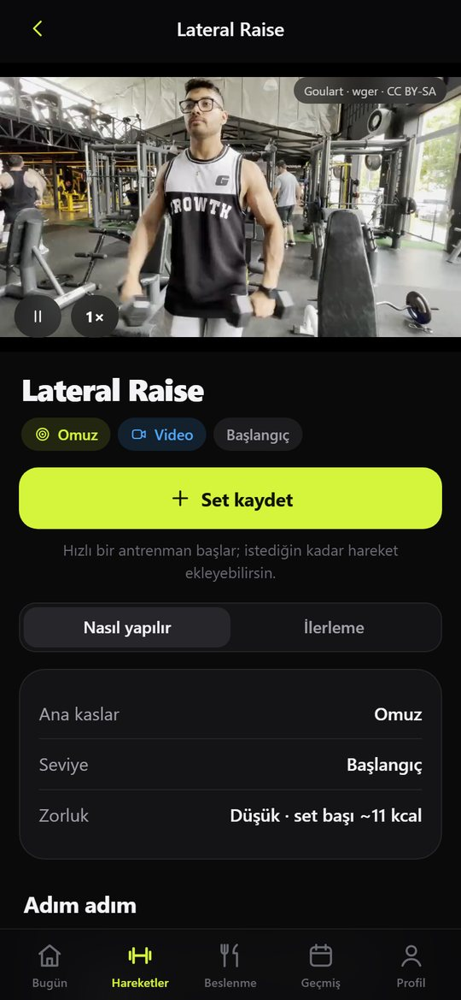
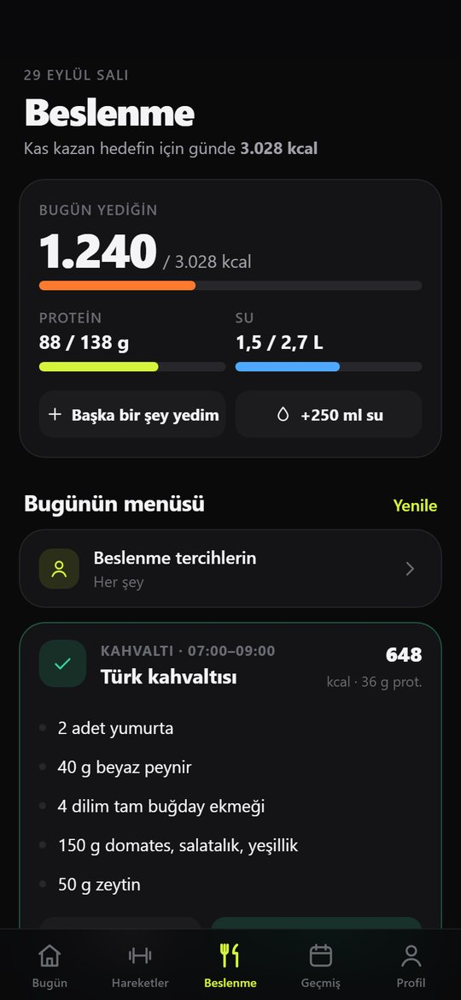
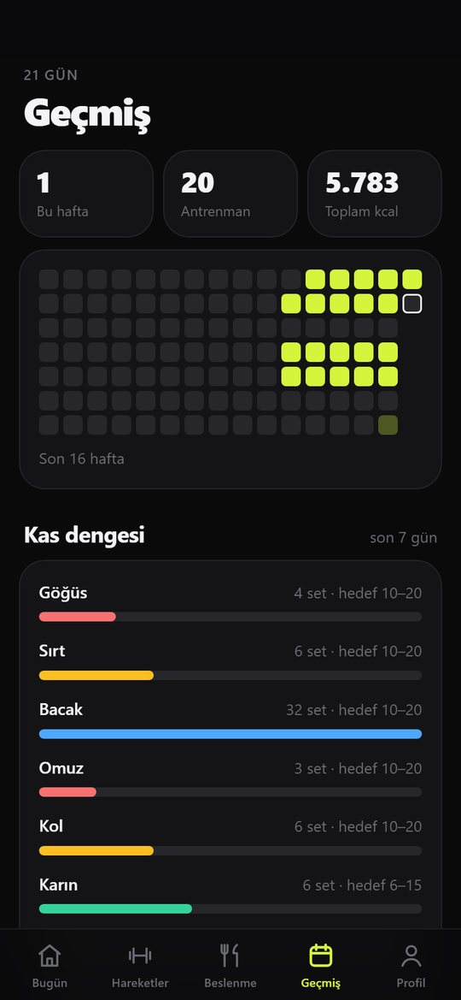
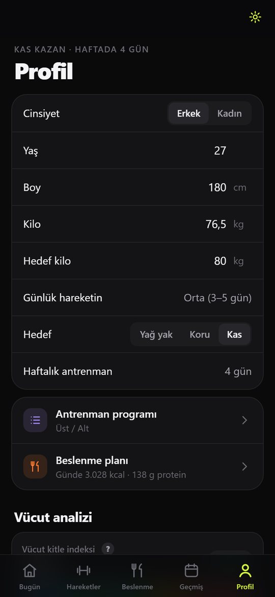

# Gym Takip

**Set, tekrar ve ağırlık takibi · gerçek egzersiz videoları · kişisel program ve beslenme planı.**
iPhone ve Android'de uygulama gibi çalışan, **internet olmadan da kullanılabilen** ücretsiz bir web uygulaması (PWA).

**▶ Uygulamayı aç: [korkmazgozc.github.io/gym](https://korkmazgozc.github.io/gym/)**



## Özellikler

**Antrenman**
- Hedefine ve haftada kaç gün spor yapabildiğine göre **otomatik program** (Tüm Vücut, Üst/Alt, İtme/Çekme/Bacak) ya da kendi programın
- Antrenman ekranında set set kayıt: önceki antrenmanın değerleri, ısınma setleri, **dinlenme sayacı**
- **İlerleme önerisi:** geçen sefer hedef tekrarların hepsini yaptıysan ağırlığı artırmayı, yapamadıysan tekrarı artırmayı önerir
- Antrenman özeti: süre, yakılan kalori, toplam kaldırılan ağırlık, rekorlar

**Hareketler**
- 6 bölgede **122 hareket**; 41 harekette gerçek **video** (72 açı), diğerlerinde başlangıç ve bitiş fotoğrafları
- Adım adım anlatım, ipuçları, çalışan ana ve yardımcı kaslar
- **Dokunulabilir vücut haritası:** kaslar son 7 günde yaptığın set sayısına göre renklenir
- Hareket başına grafikler: en ağır set, tahmini maksimum, toplam kaldırılan

**Vücut ve beslenme**
- Boy, kilo ve yaşa göre günlük kalori ihtiyacı, protein hedefi, vücut kitle indeksi, tahmini yağ oranı
- Hedefe göre (yağ yakma, formu koruma, kas kazanma) **günlük örnek menü**; porsiyonlar kalori ve protein hedefine göre ayarlanır
- Vejetaryen veya "et yok, balık var" seçeneği, yemediğin yiyecekleri çıkarma
- Kalori, protein ve su takibi; kardiyo kaydı; kilo ve vücut ölçüsü takibi

**Geçmiş**
- Antrenman takvimi, haftalık özet, bölgelere göre **kas dengesi**

| | | | |
|:-:|:-:|:-:|:-:|
|  |  |  |  |
| Bugün | Antrenman | Hareketler | Vücut haritası |
|  |  |  |  |
| Hareket detayı | Beslenme | Geçmiş | Profil |

## Telefona kurulum

**iPhone:** Linki **Safari** ile aç → alttaki **Paylaş** düğmesi → **Ana Ekrana Ekle**.
**Android:** Linki **Chrome** ile aç → sağ üstteki menü → **Ana ekrana ekle**.

İlk açılışta kısa bir kurulum (hedef, haftalık gün sayısı, boy, kilo ve yaş) programını ve beslenme hedeflerini hazırlar.

### İnternetsiz kullanım
Uygulama ve fotoğraflar ilk açılışta telefona kaydedilir. Videolar yer kapladığı için (~62 MB) ayrıca indirilir:
**Profil → ⚙ Ayarlar → İnternetsiz kullanım → İnternetsiz kullanım için indir** (Wi‑Fi'dayken yapman önerilir). Sonrasında uygulama uçak modunda da tamamen çalışır.

## Verilerin

- Tüm kayıtlar **sadece kendi telefonunda** saklanır; hiçbir sunucuya gönderilmez, hesap gerekmez.
- Uygulamayı ana ekrandan silersen verilerin de silinir. **Ayarlar → Yedek al** ile ara sıra yedek alıp iCloud Drive'a veya Google Drive'a kaydet; **Yedeği geri yükle** ile geri yükleyebilirsin.

> Kalori ve beslenme değerleri yaklaşık hesaplardır; menü örnek niteliğindedir ve bir diyetisyen planı yerine geçmez.

## Teknik

Framework ve derleme adımı olmadan düz HTML, CSS ve JavaScript (ES modülleri) ile yazıldı.

| Dosya | İçerik |
|---|---|
| `index.html`, `styles.css` | Uygulama iskeleti ve tasarım |
| `app.js` | Ekranlar, antrenman, program, hesaplamalar |
| `exercises.js` | 122 hareketin bilgileri, görselleri ve videoları |
| `nutrition.js` | Yiyecek değerleri ve menü oluşturucu |
| `bodymap.js` | Ön ve arka vücut haritası (SVG) |
| `sw.js` | Service worker: çevrimdışı önbellek, video indirme |
| `img/`, `vid/` | Hareket fotoğrafları ve videoları |

**Güncelleme yayınlamak:** Dosyaları değiştirip `sw.js` içindeki `VERSION` değerini artır (örn. `gymtakip-v11`) ve `main` dalına gönder. GitHub Pages yeni sürümü birkaç dakika içinde yayınlar. Telefonda uygulamayı kapatıp açınca güncelleme gelir.

**Bilgisayarda çalıştırmak:** Klasörde bir yerel sunucu başlatıp tarayıcıda aç:

```bash
python -m http.server 8765
```

## Görseller ve lisanslar

- **Videolar** (`vid/`): Goulart, [wger.de](https://wger.de) — [CC BY-SA 4.0](https://creativecommons.org/licenses/by-sa/4.0/). 12 saniyeye kısaltıldı ve 540p H.264'e dönüştürüldü.
- **Fotoğraflar** (`img/`): [free-exercise-db](https://github.com/yuhonas/free-exercise-db) — Unlicense (kamu malı). 720 px'e küçültüldü.
